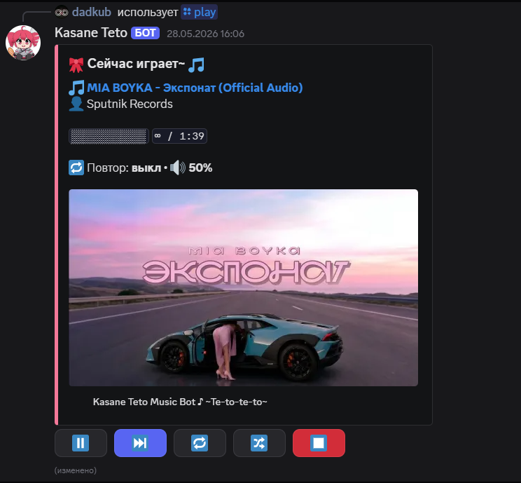

<div align="center">


# 🎀 Kasane Teto Music Bot

**A full-featured Discord music bot with AI-powered vibes — in Kasane Teto style**

[](https://python.org)
[](https://discordpy.readthedocs.io)
[](https://platform.deepseek.com)
[](LICENSE)

*~~Te-to-te-to~~ ♪*


</div>

---

## ✨ Features

### 🎵 Music Player
- Play tracks by **name or YouTube URL** via `/play`
- **Queue management** with progress bar and live timer
- **Interactive control buttons** directly under the player message (pause, skip, stop, loop, shuffle)
- **Loop modes**: single track / entire queue / off
- **Volume control** per server
- **Save & load playlists** — persistent across sessions

### 🌊 AI Vibes (powered by DeepSeek)
- **`/vibe`** — describe a mood, get a curated playlist instantly
- **`/vibe_track`** — build a wave of similar tracks based on what's currently playing
- **`/smartplaylist`** — generate and save a named AI playlist from any description

---

## 🎮 Commands

### Music

| Command | Description |
|---|---|
| `/play [query]` | Play a track by name or YouTube link |
| `/skip` | Skip the current track |
| `/stop` | Stop playback and disconnect |
| `/pause` | Pause / resume |
| `/loop [mode]` | Set loop: off / track / queue |
| `/shuffle` | Shuffle the queue |
| `/queue` | Show the current queue |
| `/nowplaying` | Current track with progress bar |
| `/volume [0-100]` | Adjust volume |
| `/playlist_save [name]` | Save queue as a playlist |
| `/playlist_load [name]` | Load a saved playlist |
| `/playlist_list` | List your saved playlists |

### 🌊 AI Vibes

| Command | Description |
|---|---|
| `/vibe [mood]` | Generate a playlist from a mood description |
| `/vibe_track` | Build a wave based on the current track |
| `/smartplaylist [name] [description]` | Create and save an AI playlist |

**Examples:**
```
/vibe sad rainy evening at home
/vibe energy for a workout
/vibe late night drive
/vibe_track
/smartplaylist lofi description: relaxed lofi beats for studying
```

---

## ⚙️ Installation

### 1. Requirements

- Python 3.10+
- FFmpeg

**Install FFmpeg:**
- **Windows:** download from [ffmpeg.org](https://ffmpeg.org/download.html), add to PATH
- **Linux:** `sudo apt install ffmpeg`
- **macOS:** `brew install ffmpeg`

### 2. Clone the repository

```bash
git clone https://github.com/dadkubs/kasane-teto-bot.git
cd kasane-teto-bot
```

### 3. Install dependencies

```bash
pip install -r requirements.txt
```

### 4. Configure environment

Create a `.env` file (or edit `bot.py` directly):

```env
DISCORD_TOKEN=your_discord_bot_token
DEEPSEEK_API_KEY=your_deepseek_api_key
```

**Where to get the keys:**
- Discord token: [discord.com/developers](https://discord.com/developers/applications)
- DeepSeek API: [platform.deepseek.com](https://platform.deepseek.com)

### 5. Run the bot

```bash
python bot.py
```

---

## 🔧 Discord Bot Setup

1. Go to [discord.com/developers/applications](https://discord.com/developers/applications)
2. Click **New Application** → give it a name
3. Go to **Bot** tab → copy the token
4. Enable **Privileged Gateway Intents**: ✅ Presence, ✅ Server Members, ✅ Message Content
5. Go to **OAuth2 → URL Generator** → select `bot` + `applications.commands`
6. Required permissions: `Connect`, `Speak`, `Send Messages`, `Embed Links`, `View Channels`
7. Copy the generated URL and invite the bot to your server

---

## 📦 Dependencies

```
discord.py>=2.3.0
yt-dlp>=2024.1.1
PyNaCl>=1.5.0
openai>=1.0.0
httpx>=0.25.0
```

---

## 🏗️ Project Structure

```
kasane-teto-bot/
├── bot.py              # Main bot file (726 lines)
├── requirements.txt    # Python dependencies
├── playlists.json      # Auto-generated: saved user playlists
└── README.md
```

**Key components in `bot.py`:**
- `MusicView` — Discord UI button controller (pause/skip/loop/shuffle/stop)
- `search_and_get_info()` — async yt-dlp wrapper
- `play_next()` / `_play_next_coro()` — queue & loop engine
- `deepseek_tracklist()` — AI track generation via DeepSeek API
- Slash commands: `/play`, `/vibe`, `/smartplaylist` and more

---

## 🤝 Contributing

Pull requests are welcome! For major changes, please open an issue first.

---

## 📄 License

MIT License — free to use and modify.

---

<div align="center">

Made with 🎀 by [dadkubs](https://github.com/dadkubs)

*~~Te-to-te-to~~ ♪*

</div>
